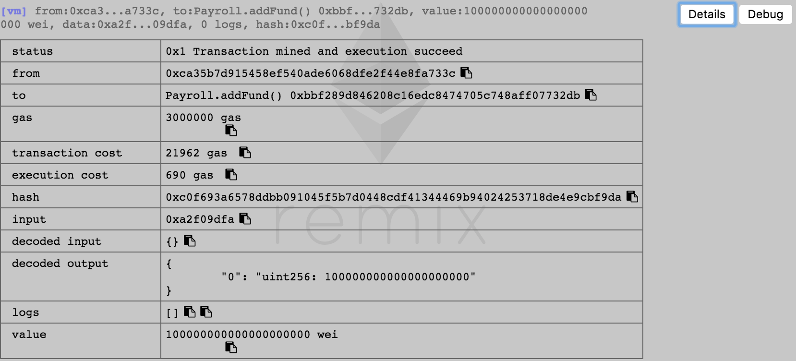
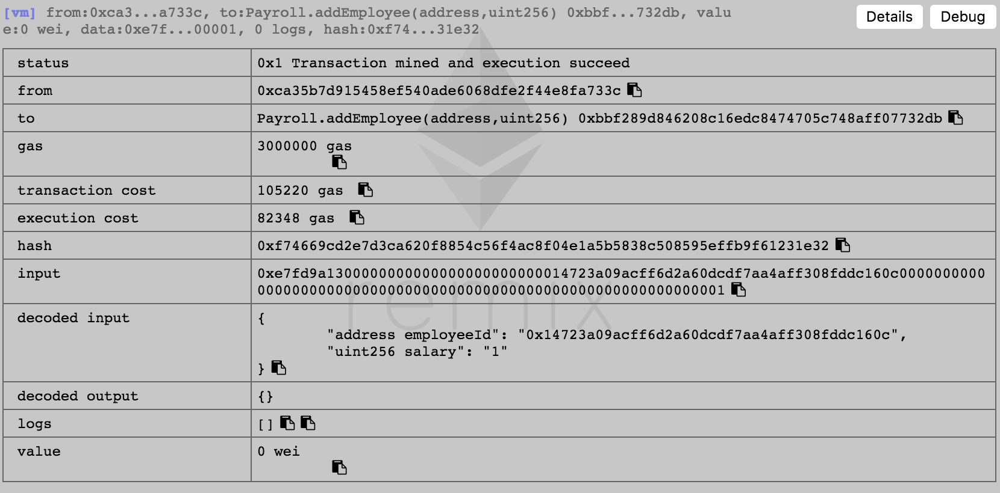
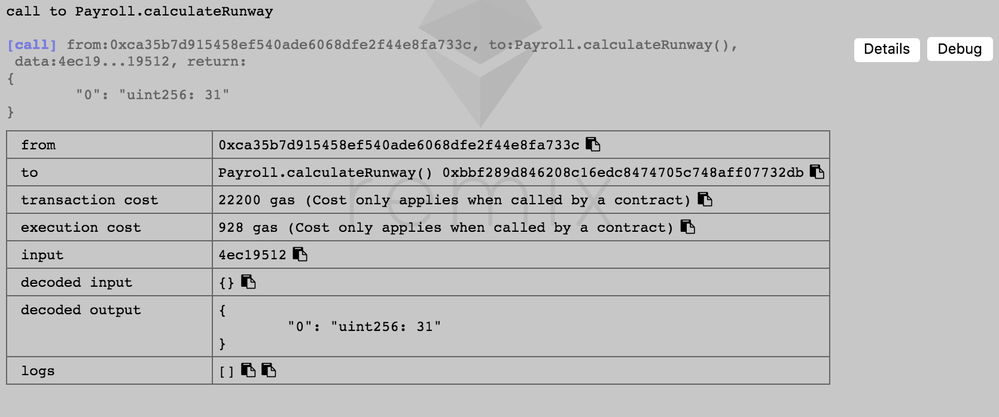
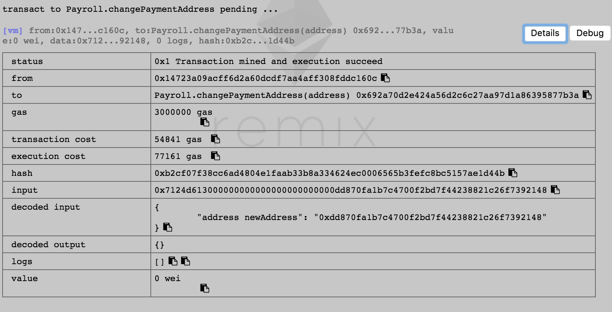
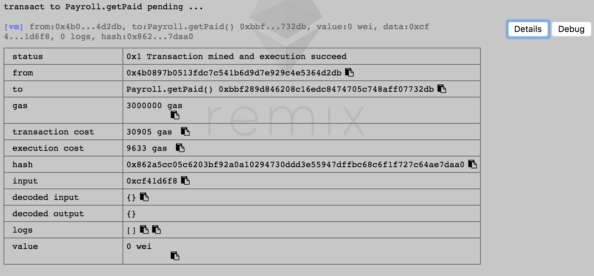
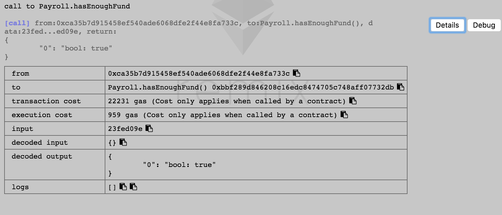
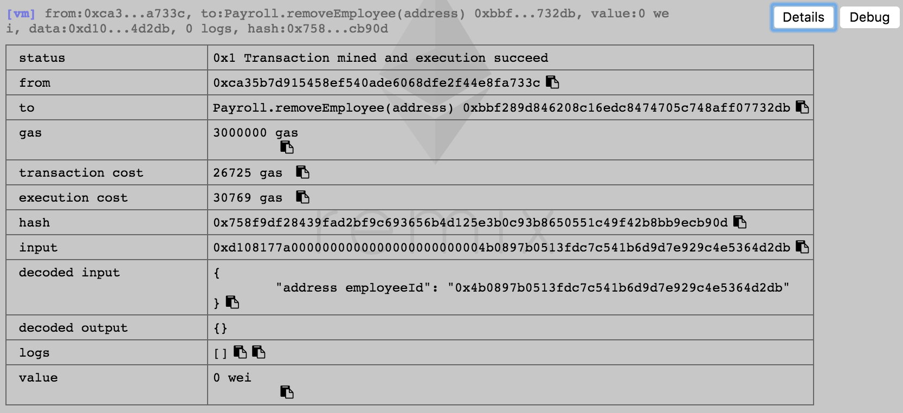
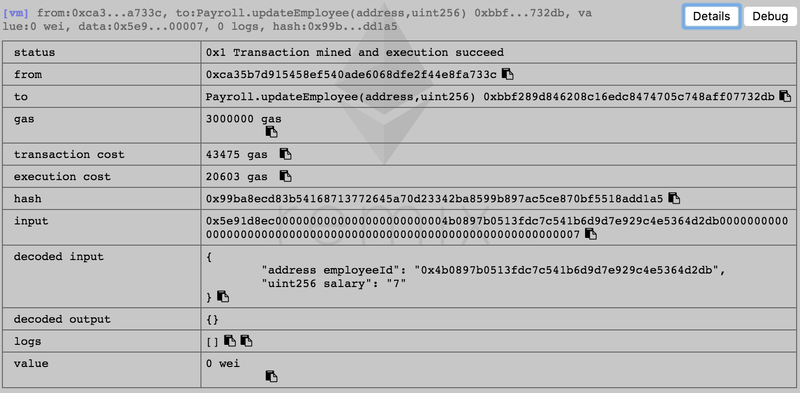
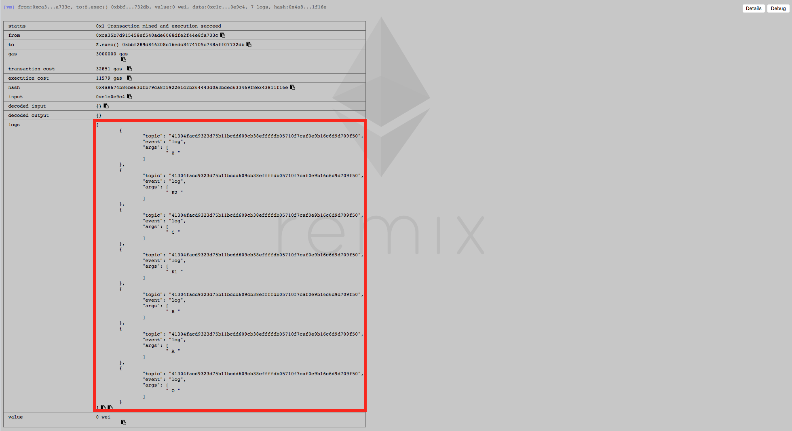

# homework3

## Q1
作业内容见 **Payroll.sol**

#### addFund


#### addEmployee


#### calculateRunway


#### changePaymentAddress


#### getPaid


#### hasEnoughFund


#### removeEmployee


#### updateEmployee


## Q2
作业内容见 **Payroll.sol中changePaymentAddress函数的实现，使用modifier实现了删除employees中某个元素的功能**

## Q3
```
L(O) := [O]  
L(A) := [A] + merge(L(O), [O]) // A本身 + merge(L(父亲) + 父亲列表)
      = [A] + merge([O], [O])
      = [A, O]  
L(B) := [B, O]
L(C) := [C, O]
L(K1):= [K1] + merge(L(B), L(A), [B, A])
      = [K1] + merge([B, O], [A, O], [B, A])
      = [K1, B] + merge([O], [A, O], [A])
      = [K1, B, A] + merge([O], [O])
      = [K1, B, A, O] 
L(K2):= [K2, C, A, O] 
L(Z) := [Z] + merge(L(K2), L(K1), [K2, K1])
      = [Z] + merge([K2, C, A, O], [K1, B, A, O], [K2, K1] )
      = [Z, K2] + merge([C, A, O], [K1, B, A, O], [K1] )
      = [Z, K2, C] + merge([A, O], [K1, B, A, O], [K1] )
      = [Z, K2, C, K1] + merge([A, O], [B, A, O] )
      = [Z, K2, C, K1, B] + merge([A, O], [A, O] )
      = [Z, K2, C, K1, B, A] + merge([O], [O] )
      = [Z, K2, C, K1, B, A, O]
```

验证可见 **MultiInher.sol的结果如下**


